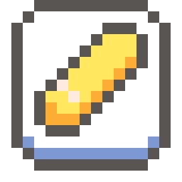
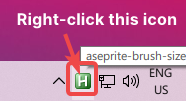

# Aseprite Brush Size Hotkey

    

> A very simple AutoHotKey (AHK) script that tries to replicate the behaviour of WispY's AseBrush Java applet, as shown in  [AdamCYounis' awesome "Aseprite Crash Course" video!](https://youtu.be/59Y6OTzNrhk)

***Note:** This is my first AutoHotKey script, so it's not quite ideal but it works well enough that I thought I'd share it. You're more than welcome to fork/PR any changes to improve this!*

## Usage

Hold the `D` key and move your mouse/pen in either the X or Y axis (default X axis, which can be changed in the AHK script version) to adjust the size of the brush whilst Aseprite is the active window!

You can toggle pausing the script by using the shortcut `CTRL + ALT + D` whilst Aseprite is the active window.

## Running/use binary

***Note:** The standalone version doesn't require AHK to be installed!*

### Standalone Version

**[Download Latest Standalone Windows Binary](https://github.com/arcticnoah/aseprite-brush-size-hotkey/releases/latest) ([Created using Ahk2Exe, with MPRESS compression](https://github.com/AutoHotkey/Ahk2Exe))**

Running the downloaded .exe will run the script in the background and will only be interact with `aseprite.exe` when it's the active window.

<h6 align="center">
    
     
     
    You can close the script at any time from the system tray, by right-clicking it!
</h6>

### AHK Script Version

**[Download Latest AHK Script](https://github.com/arcticnoah/aseprite-brush-size-hotkey/blob/main/aseprite-brush-size-hotkey.ahk) ([Requires AHK to be installed](https://www.autohotkey.com/))**

How to run the script can be read [from the AHK documentation](https://www.autohotkey.com/docs/Program.htm#run)

## Planned Features/Changes

- [x] Fix issue with script sometimes scrolling rather than changing brush size (issue with tick rate being too high?)
- [x] Still be able to type lowercase `d` (checks if the mouse moved above a configurable threshold (default: 4 pixels) or you can now use `CTRL + ALT + D` to toggle pause the script)
- [ ] Allow the script to increase the brush size in increments other than just one
- [ ] Change the config variables from the system tray (not sure if this is possible. If it is, also look into keeping it persistent)
- [ ] Just found out Aesprite scripting exists (even tho I've been using some extensions/scripts already, woops), try porting this into a script (would make it better + easier to use for everyone, including me!)
